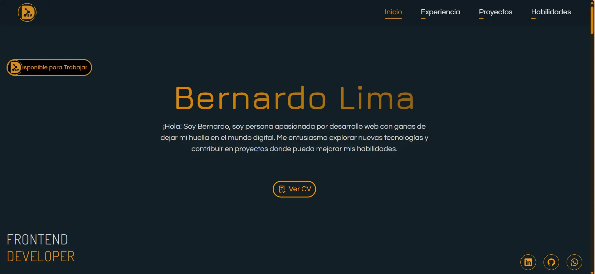

# 💼 Portfolio Personal

<div align="center">
  
</div>

## Instalación y ejecución

Puedes clonar el repositorio o descargar el archivo ZIP del proyecto.

1. **Clonar el repositorio:**
  ```bash
    git clone https://github.com/Usuario6842/BernardoLima-DevPortfolio.git
  ```

2. **Descargar el archivo ZIP:**

   [Descargar ZIP](https://github.com/Usuario6842/BernardoLima-DevPortfolio/archive/refs/heads/main.zip)

3. **Instalar dependencias:**

   puedes navegar hasta la ruta "/" y ejecuta: 
  ```bash
    pnpm install
  ```

4. **Iniciar la aplicación:**

   para iniciar la aplicación ejecuta el siguiente comando: 
  ```bash
    pnpm run start
  ```

5. **Ejecutar la aplicación en modo desarrollo:**

   para iniciar la aplicación en el modo de desarrollo ejecuta el siguiente comando: 
  ```bash
    pnpm run dev
  ```

### ¡Gracias por tu interés!

¡Espero que lo disfrutes. Si tienes alguna duda o sugerencia, no dudes en contactarme. 💚💚💚

